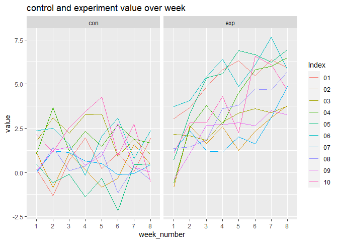
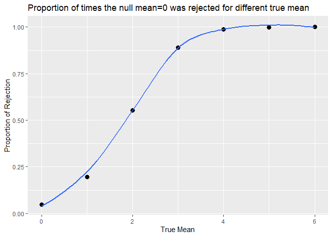

p8105_hw5_sx2337
================
Shun Xie
2022-11-03

``` r
#load packages
library(tidyverse)
```

    ## ── Attaching packages ─────────────────────────────────────── tidyverse 1.3.2 ──
    ## ✔ ggplot2 3.3.6      ✔ purrr   0.3.4 
    ## ✔ tibble  3.1.8      ✔ dplyr   1.0.10
    ## ✔ tidyr   1.2.0      ✔ stringr 1.4.1 
    ## ✔ readr   2.1.2      ✔ forcats 0.5.2 
    ## ── Conflicts ────────────────────────────────────────── tidyverse_conflicts() ──
    ## ✖ dplyr::filter() masks stats::filter()
    ## ✖ dplyr::lag()    masks stats::lag()

``` r
library(dbplyr)
```

    ## 
    ## 载入程辑包：'dbplyr'
    ## 
    ## The following objects are masked from 'package:dplyr':
    ## 
    ##     ident, sql

``` r
options(tibble.print_min = 5)
```

# Problem 1

``` r
All_files_names = list.files("data/")

All_files = 
  tibble(
    Name = str_remove(All_files_names, ".csv")) %>% 
  separate(Name, into = c("Control_Experiment","Index"), sep = "_") %>% 
  mutate(results =purrr::map(.x = str_c("data/",All_files_names), ~read_csv(.x, show_col_types = FALSE))) %>% 
  unnest(results) %>% 
  pivot_longer(
    cols = starts_with("week_"),
    names_to = "week_number",
    names_prefix = "week_",
    values_to = "value"
  ) %>% 
  ggplot(aes(x = week_number, y=value, group = Index))+
  geom_line(aes(color = Index)) + facet_grid(. ~ Control_Experiment)
All_files
```

<!-- -->
Over the time, experiment group has a persistent increase over the week
while the control group has value relatively stable values below 5.0.

# Problem 2

``` r
homocide_data = read_csv("data-homicides-master/homicide-data.csv", show_col_types = FALSE)
homocide_data
```

    ## # A tibble: 52,179 × 12
    ##   uid    repor…¹ victi…² victi…³ victi…⁴ victi…⁵ victi…⁶ city  state   lat   lon
    ##   <chr>    <dbl> <chr>   <chr>   <chr>   <chr>   <chr>   <chr> <chr> <dbl> <dbl>
    ## 1 Alb-0…  2.01e7 GARCIA  JUAN    Hispan… 78      Male    Albu… NM     35.1 -107.
    ## 2 Alb-0…  2.01e7 MONTOYA CAMERON Hispan… 17      Male    Albu… NM     35.1 -107.
    ## 3 Alb-0…  2.01e7 SATTER… VIVIANA White   15      Female  Albu… NM     35.1 -107.
    ## 4 Alb-0…  2.01e7 MENDIO… CARLOS  Hispan… 32      Male    Albu… NM     35.1 -107.
    ## 5 Alb-0…  2.01e7 MULA    VIVIAN  White   72      Female  Albu… NM     35.1 -107.
    ## # … with 52,174 more rows, 1 more variable: disposition <chr>, and abbreviated
    ## #   variable names ¹​reported_date, ²​victim_last, ³​victim_first, ⁴​victim_race,
    ## #   ⁵​victim_age, ⁶​victim_sex

The data contains `12` number of columns corresponding to different
variables:

uid is a variable that uniquely identify the homocide case. Reported
date gives the data that the homocide case is reported. Victim
information such as the person’s last name, first name, race, age and
sex are also included in the variables. City and State variable
corresponds to the city and state that the homocide happens, as well as
the exact location measured in latitude and longitude in lat and lon
variables in the dataset. The disposition variable shows the current
state of the case. There are `3` unique status of disposition, namely
`Closed without arrest, Closed by arrest, Open/No arrest`.

Combine the city_state. Then summarize within cities to obtain the total
number of homicides and the number of unsolved homicides.

``` r
homocide_data_new = 
  homocide_data %>%
  mutate(city_state = str_c(city, ", ", state)) 

homocide_data_new%>% 
  group_by(city_state) %>% 
  summarize(
    n_obs = n(),
    n_unsolved = sum(disposition=='Closed without arrest')+sum(disposition=='Open/No arrest')
  ) %>% 
  arrange(desc(n_obs))
```

    ## # A tibble: 51 × 3
    ##   city_state       n_obs n_unsolved
    ##   <chr>            <int>      <int>
    ## 1 Chicago, IL       5535       4073
    ## 2 Philadelphia, PA  3037       1360
    ## 3 Houston, TX       2942       1493
    ## 4 Baltimore, MD     2827       1825
    ## 5 Detroit, MI       2519       1482
    ## # … with 46 more rows

For the city of Baltimore, MD, the proportion of homicides that is
unsolved can be calculated here:

``` r
homocide_data_new_Baltimore = filter(homocide_data_new, city_state == "Baltimore, MD")  

#save as an R object 
prop_Baltimore_result = prop.test(sum(homocide_data_new_Baltimore$disposition=='Closed without arrest' | homocide_data_new_Baltimore$disposition=='Open/No arrest'),length(homocide_data_new_Baltimore$disposition))

#save the data
save(prop_Baltimore_result, file = "results/Prop_result_Baltimore.RData")


#apply tidy function and pull the estimate and confidence intervals
prop_Baltimore_result %>% 
  broom::tidy() %>% 
  select(estimate, conf.low, conf.high)
```

    ## # A tibble: 1 × 3
    ##   estimate conf.low conf.high
    ##      <dbl>    <dbl>     <dbl>
    ## 1    0.646    0.628     0.663

For all cities, first get all the distinct cities vector, and create a
function that do the exact the same thing with city Baltimore:

``` r
all_distinct_city = unique(homocide_data_new$city_state)


#define function
prop_test_function = function(cityname){
  dataset = filter(homocide_data_new, city_state == cityname)
  
  result = 
    prop.test(sum(dataset$disposition=='Closed without arrest' | dataset$disposition=='Open/No arrest'), length(dataset$disposition)) %>% 
    broom::tidy() %>% 
    select(estimate, conf.low, conf.high)

  #return result
  result
}
```

Now can iterate over all distinct cities using apply function and store
in a list:

``` r
prop_test_output = 
  expand_grid(city_name = all_distinct_city) %>% 
  mutate(test_df = map(all_distinct_city, prop_test_function)) %>% 
  unnest(test_df) %>% 
  arrange(desc(estimate))
```

    ## Warning in prop.test(sum(dataset$disposition == "Closed without arrest" | : Chi-
    ## squared近似算法有可能不准

``` r
prop_test_output
```

    ## # A tibble: 51 × 4
    ##   city_name          estimate conf.low conf.high
    ##   <chr>                 <dbl>    <dbl>     <dbl>
    ## 1 Chicago, IL           0.736    0.724     0.747
    ## 2 New Orleans, LA       0.649    0.623     0.673
    ## 3 Baltimore, MD         0.646    0.628     0.663
    ## 4 San Bernardino, CA    0.618    0.558     0.675
    ## 5 Buffalo, NY           0.612    0.569     0.654
    ## # … with 46 more rows

``` r
ggplot(prop_test_output, aes(x=fct_reorder(city_name, estimate), y=estimate))+
  geom_point()+
  coord_flip()+
  geom_errorbar(aes(ymin=conf.low, ymax=conf.high))+
  labs(title = "Proportion of unsolved homocide among cities", )+xlab("City")
```

<!-- --> The
estimates are as indicated above. Tulsa, AL is the region that have only
one case and the case is solved. Therefore, the confidence interval is
large.

# Problem 3

Define a function so that the input can take the value for sample size,
population mean and population variance. Operate t test on the simulated
sample to give a result to t test.

``` r
#Set the design elements in the default of function
sim_t_test = function(n=30, mu = 0, sigma = 5) {
  sim_data = tibble(x = rnorm(n, mean = mu, sd = sigma))
  
  sim_data %>% 
    t.test(mu=0, alpha =.05) %>% 
    broom::tidy() %>% 
    select(estimate, p.value)
}
sim_t_test()
```

    ## # A tibble: 1 × 2
    ##   estimate p.value
    ##      <dbl>   <dbl>
    ## 1    0.847   0.420

Now generate 5000 times and save mu and pvalue:

``` r
sim_results_mu0 = 
  expand_grid(
    mu_val = 0,
    iter = 1:5000
  ) %>% 
  mutate(
    estimate_df = map(.x = mu_val, ~sim_t_test(mu=.x))
  ) %>% 
  unnest(estimate_df)
```

Based on the function, we can repeat over $\mu=\{0,1,2,3,4,5,6\}$ using
apply function:

``` r
sim_results_over_mu = 
  expand_grid(
    mu_val=0:6,
    iter = 1:5000
  ) %>% 
  mutate(
    estimate_df = map(.x = mu_val, ~sim_t_test(mu=.x))
  ) %>% 
  unnest(estimate_df)
```

Now make a plot showing the proportion of times the null was rejected
for each mu:

``` r
sim_results_over_mu %>% 
  group_by(mu_val) %>% 
  summarize(proportion = sum(p.value<0.05)/length(p.value)) %>% 
  ungroup() %>% 
  ggplot(aes(x=mu_val, y=proportion))+
  geom_point(shape=19,size = 3)+
  labs(title = "Proportion of times the null mean=0 was rejected for different true mean" )+
  xlab("True Mean")+
  ylab("Proportion of Rejection")
```

<!-- -->

Our hypothesis states that the mean equal to 0. As indicated by the
plot, when the true mean increases, the power of rejecting the null
hypothesis increases because there is a greater proportion of simulated
sample has a pvalue smaller than 0.05. Therefore, when the true mean is
more away from the hypothesis mean which is 0, (so the effect size
measuring the differences between group with $\mu =0$ and true mean is
larger), the test has more power to reject the null hypothesis. With a
simulation of 5000 times, the relative big simulated number makes the
plotting more stable and therefore more reliable.

Now, I make a plot showing the average estimate of mean $\hat\mu$
against the true value of $\mu$:

``` r
#define all_estimate_df to represent the average estimate value for all simulated values
all_estimate_df = sim_results_over_mu %>% 
  group_by(mu_val) %>% 
  summarize(avg_mu_hat = mean(estimate)) %>% 
  ungroup()

#define rejected_estimate_df to represent the average estimate value only in samples for which the null was rejected 
rejected_estimate_df = sim_results_over_mu %>% 
  filter(p.value<0.05) %>% 
  group_by(mu_val) %>% 
  summarize(avg_mu_hat = mean(estimate)) %>% 
  ungroup()


ggplot(all_estimate_df, aes(x=mu_val, y=avg_mu_hat))+
  geom_line(aes(color = "a"))+
  geom_line(data = rejected_estimate_df,aes(color = "b"))+
  scale_color_manual(name = ' ', 
                     values =c("a"='black',"b"='red'), 
                     labels = c('all values','rejected null values'))+
  geom_point(shape=19,size = 3)+
  geom_point(data = rejected_estimate_df,color = "red", shape=19,size = 3)+
  labs(title = "Average estimate of mean against the true value of mean" )+
  xlab("True Mean")+
  ylab("Average Estimated Mean")
```

<!-- -->

In accordance to the plot, it seems like the sample average of
$\hat \mu$ across tests for which the null is rejected is not
approximately equal to the true value of $\mu$. When the true mean is
between 0 and 4, the estimated values are very different from each
other. This is because for all rejected null values, there estimated
value are significantly different from the null hypothesis $\mu =0$.
Thus, their estimated mean will likely to be greater than the overall
estimated mean which includes estimated mean that is close to null
hypothesis $\mu = 0$. But when the power of the test gets stronger, the
average estimated mean for simulation with null rejected is similar to
the one for all simulations. Especially for the case when effect size is
large, in which case almost all cases are rejected. And therefore,
estimate values for simulations with null rejected are tend to the
estimated values for all cases.
